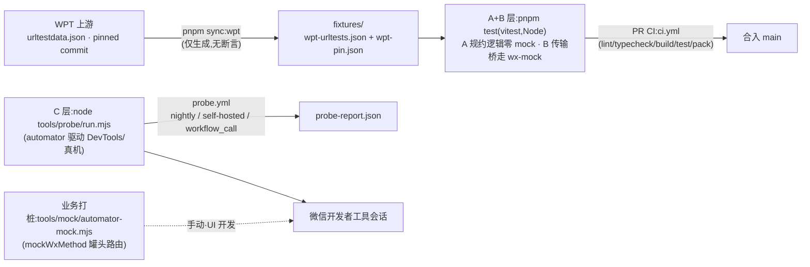

# cornworld-miniprogram-polyfill

微信小程序**逻辑层**的 Web API polyfill 家族:`fetch` / `EventSource` / `TextEncoder` / `URL` / `localStorage` / `FormData`…,定位是**组装层 + 冲突管理层**,不是从零造轮子。

> 背景:微信小程序逻辑层没有 `fetch`、`EventSource`、`localStorage`、`FormData` 全局对象
> (官方网络 API 只有 `wx.request`/`wx.uploadFile`/WebSocket 等),导致 PocketBase JS SDK 等
> Web 生态库无法直接运行。渲染引擎(Skyline / WebView)只影响渲染层,逻辑层 API 在两者下一致,
> 因此本仓库所有 polyfill 双引擎通用,无需引擎分支。

## 包矩阵

| 包                             | 覆盖                                                                                            | 规约引擎(依赖)                                                                                                                                                    | 手写部分(wx 桥)                                                  |
| ------------------------------ | ----------------------------------------------------------------------------------------------- | ----------------------------------------------------------------------------------------------------------------------------------------------------------------- | ---------------------------------------------------------------- |
| `@cornworld/mp-core`           | 运行时检测、AbortError、字节工具                                                                | —                                                                                                                                                                 | `WxLike` 最小接口(全家族唯一 seam)                               |
| `@cornworld/mp-text-encoding`  | `TextEncoder` / `TextDecoder`(UTF-8,流式)                                                       | —(现有实现要么失修要么含全部遗留编码太重,故自写)                                                                                                                  | WHATWG utf-8 编解码状态机                                        |
| `@cornworld/mp-url`            | `URL` / `URLSearchParams` / `canParse` / `parse`                                                | `whatwg-url` **纯状态机深路径**(`lib/url-state-machine` + `lib/urlencoded`;主入口 webidl2js 包装层运行时需 eval,小程序逻辑层没有,不可用——2026-10-03 真机实测修复) | 薄包装 + canParse/parse 增补、URLSearchParams 规范类(纯函数引擎) |
| `@cornworld/mp-fetch`          | `fetch` / `Request` / `Response` / `Headers` / `AbortController` / `Blob` / `File` / `FormData` | 流式:`web-streams-polyfill`(peer,可注入)                                                                                                                          | `wx.request` 传输桥、multipart 序列化、Abort 实现                |
| `@cornworld/mp-eventsource`    | `EventSource`(SSE)                                                                              | `eventsource-parser`(线格式解析)                                                                                                                                  | `wx.request enableChunked` 传输、重连状态机、MIME 门控           |
| `@cornworld/mp-storage`        | `localStorage`                                                                                  | —                                                                                                                                                                 | `wx.setStorageSync` 桥、配额错误映射                             |
| `@cornworld/mp-web-runtime`    | 一站式 API 级安装器                                                                             | `web-streams-polyfill`                                                                                                                                            | 冲突检测 / 标记 / 诊断                                           |
| `@cornworld/wx-mock`(internal) | 测试专用模拟宿主                                                                                | —                                                                                                                                                                 | Node http 版 `wx.request` / storage                              |

> npm scope `@cornworld` 为占位:首次发布前替换为你的 npm org 即可(全局替换包名 + `.changeset/config.json`)。

## 测试边界(本仓库的宪法)

目标:每一步都在最佳收益点上——保证正确性、减少粘合代码、在非小程序环境验证逻辑层。

**手法:把「环境差异」压缩到一个接口 + 一个 mock + 一个探针;fixture 是唯一货币,runner 只是薄适配器。**

### 链路总览(谁在什么时候跑什么)



| 入口                                                        | 层   | 环境                       | 断言发生在哪                  | 何时跑                                      |
| ----------------------------------------------------------- | ---- | -------------------------- | ----------------------------- | ------------------------------------------- |
| `pnpm test`                                                 | A+B  | Node(vitest)               | 测试文件内,红即失败           | 本地每次改动 + PR CI(ci.yml)                |
| `pnpm sync:wpt`                                             | 语料 | 网络                       | 不断言,只刷新 fixture + pin   | 引擎/WPT 升级时手动                         |
| `node tools/probe/run.mjs --project …`                      | C    | DevTools / 真机(automator) | runner 汇总 checks,非零退出码 | probe.yml 每日 05:05 / 手动 / workflow_call |
| `node tools/mock/automator-mock.mjs --project … --routes …` | 打桩 | DevTools 自动化会话        | 无断言(开发辅助)              | UI 开发时手动                               |

语料单币种:URL 一致性只有 `wpt-urltests.json`(sync-wpt 生成,pin 门禁在 wpt-corpus.test.ts);上游语料覆盖不到的语义(RFC 3986 相对解析段、显式/空端口、路径 %20/%2F 正例)以类型化内联用例放在 url.test.ts,不落第二份 JSON。

### 按环境分层(A/B/C)

| 层               | 覆盖                                                                             | 环境                                                         | 粘合成本                                            |
| ---------------- | -------------------------------------------------------------------------------- | ------------------------------------------------------------ | --------------------------------------------------- |
| **A 规约逻辑**   | 编解码 / URL / Headers / FormData / multipart / SSE 解析 / Request-Response 语义 | Node(vitest),零 mock                                         | **0**                                               |
| **B 传输桥协议** | `wx.request` 映射、abort、超时、chunked 分帧、错误语义                           | Node + `@cornworld/wx-mock`(唯一 mock,~200 行)               | 一次编写,fetch / eventsource / 未来 pb-sdk 三方复用 |
| **C 运行时探针** | 真机才有的事件:非 2xx 空 body、切后台杀连接、enableChunked→HTTP/1.1 等           | DevTools / 真机(`miniprogram-automator` 驱动,`tools/probe/`) | 一个探针页 + 一个 runner,不进 PR CI                 |

### 外部依赖引擎的测试深度分档(T1–T4)

深度 = 上游信任度 × 我们的暴露面 × 运行时差异风险。**优先复用上游已有测试资产,数据驱动用例的边际成本只是一个 runner。**

| 档            | 对象                                                                | 做法                                                                                                                                              | 资产来源       |
| ------------- | ------------------------------------------------------------------- | ------------------------------------------------------------------------------------------------------------------------------------------------- | -------------- |
| T1 冒烟       | `web-streams-polyfill`                                              | 只测我们用到的 API 面(5 个方法),防升级破坏                                                                                                        | 自写 3 例      |
| T2 契约面     | `eventsource-parser`                                                | WPT `eventsource/format-*` 移植 fixture(~26 例)跑「我们的分帧 + 解码 + 它的解析」整链                                                             | WPT 移植       |
| T3 全量一致性 | `whatwg-url`                                                        | WPT `urltestdata.json` 全量(483 例 http/https)数据驱动 + **已知偏差基线升级门**:`pnpm sync:wpt` 钉 commit,引擎升级重跑,新偏差红灯、偏差消失也红灯 | WPT 官方       |
| T4 全测       | 自研(codec / abort / headers / form-data / multipart / 桥 / 状态机) | 单测 + fixture 全覆盖                                                                                                                             | 自写(移植 WPT) |

已知偏差基线见 `packages/mp-url/test/fixtures/wpt-known-failures.json`(当前 7 条,全部是 IDNA/punycode 域名校验类规约收紧项,与小程序 API 域名场景无关)。刷新基线:

```bash
UPDATE_URL_BASELINE=1 pnpm vitest run packages/mp-url
```

**不测什么(C 层边界)**:CORS / 凭据 / 手动重定向语义(小程序无 CORS,wx 自动跟随重定向,文档化 non-goal);不重测引擎内部(T1–T3 已覆盖我们的暴露面);真机不进 CI(automator 需 DevTools 登录态,PR CI 养不起,改为 nightly + self-hosted)。

## 冲突管理

每个包内部**永不依赖全局污染**(只 import 自己的模块);只有安装器碰全局,规则:

1. 宿主原生实现、第三方 polyfill(如 `@wevu/web-apis`)已存在的 API **默认跳过**;
2. `force: true` 显式接管(上报 `replaced`);
3. 本家族重复安装幂等(`skipped`);
4. 已安装实现打 `Symbol.for('cornworld.mp-polyfill')` 家族标记,可诊断来源;
5. 安装 `ReadableStream` 后自动接通 fetch 流式通道。

```ts
import { installWebRuntimeGlobals, listGlobalsStatus } from '@cornworld/mp-web-runtime'

const report = installWebRuntimeGlobals() // 全量,冲突安全
// installWebRuntimeGlobals({ targets: ['fetch', 'EventSource'] })  // API 级粒度
// installWebRuntimeGlobals({ targets: ['URL'], force: true })      // 显式接管
console.log(report) // { installed, skipped, replaced }
console.log(listGlobalsStatus()) // [{ name, source: 'ours' | 'host' | 'absent' }]
```

也可以不用安装器,直接包级引入(PocketBase SDK 场景推荐):

```ts
import { fetch, FormData, Blob } from '@cornworld/mp-fetch'
import { localStorage } from '@cornworld/mp-storage'
import { EventSource } from '@cornworld/mp-eventsource'
import { PocketBase } from 'pocketbase'

// PB SDK 的 options.fetch / authStore / realtime 三处接入点详见 pb-sdk 仓库(规划中)
```

## 小程序真机差异 checklist(实现与测试时对照)

- `wx.request` 默认 `timeout` 60s:长连接(EventSource / SSE 流)必须显式调大;
- 小程序切后台 5s 内未完成的请求被 kill(`fail interrupted`):`App.onShow` 里重连重订阅;
- `enableChunked` 走 HTTP/1.1(chunked 与高性能模式互斥);真机 chunked 模式下非 2xx 响应可能拿不到 body;
- `onChunkReceived` 回调给 `ArrayBuffer`,跨 chunk 会截断 UTF-8 多字节字符(用 `TextDecoder({ stream: true })` 增量解码);
- `wx.request` 并发上限 10(EventSource 单条长连接复用全部订阅,PB 场景够用);
- 域名白名单:HTTPS + 有效证书 + ICP 备案(PB 生产部署硬门槛)。

## 发布

- 版本与 CHANGELOG:[changesets](https://github.com/changesets/changesets)——PR 带 `.changeset/*.md`,合入 main 后 bot 开版本 PR,合并即发布;
- `pnpm changeset:publish` 带 `--provenance`(npm provenance,需仓库开启 OIDC);
- 双通道:npm registry + GitHub Actions artifacts(`ci.yml` 每次 push、`release.yml` 发布时归档全部 tarballs);
- 密钥:仓库 Secret 配 `NPM_TOKEN`(automation token)。

## 探针(C 层)

```bash
node tools/probe/run.mjs --project <小程序工程路径> --page pages/probe/probe
# 包装 SDK 全链路 demo(auth/CRUD/文件上传/realtime),指向 Docker PB:
node tools/probe/run.mjs --project <工程> --page pages/probe/probe \
  --ws 9421 --build-npm --fresh --pb http://127.0.0.1:8091
# Docker PB(与原生 8090 并存,同版本同种子):pb-sdk 仓库 scripts/ensure-pb-docker.sh
```

- 驱动:微信开发者工具自动化端口;本仓库用 `miniprogram-automator`(JS,与工具链同源),官方 `minium`(Python)驱动同一端口。**mock 语义勘误(2026-10-03 核对官方文档)**:两者的官方 mock(`mockWxMethod` / `mock_wx_method`)都是「结果替换」,没有函数体形式;真正的「函数体接管」原语是 `evaluate()` 向 AppService 注入代码——automator 与 minium 同源具备,无需为此引入 Python 工具链;
- 检查项三组:静态(安装器冒烟)+ live 真传输(本机 http 服务,DevTools 关闭域名校验直连 127.0.0.1)+ **hijack 确定性罐头**(evaluate 接管 `wx.request`,复放真 HTTP 无法稳定构造的时序:字节级 chunk 截断 / mid-stream abort / 非 2xx 空 body / SSE 跨 chunk 断字);
- **会话形态(零弹窗)**:runner 优先 `automator.connect` 到常驻实例(默认 `ws://127.0.0.1:9420`,`--ws` 可改),连不上才 `launch`(端口可指定);结束默认 `disconnect` 保留实例,`--close` 才关闭。反复 launch/close 才是弹窗元凶;Docker 跑 DevTools 不可行(官方无 Linux 版,非官方 wine 移植脆弱),常驻实例 + connect 即官方推荐形态;
- **DevTools 单实例架构**:`cli build-npm` 会路由进已运行实例 —— npm 构建必须放在会话建立之后(runner 的 `--build-npm` 即此;先 build-npm 后 launch 会因服务端口被占而失败),也绝不能 pkill「清理」(杀的就是同一个常驻实例);构建触发重编译,与页面导航有竞速,runner 以沉淀等待 + 导航重试规避;
- **PR 即真环境门禁**:宿主仓库(如 jgst)经 `workflow_call` 调用 `probe.yml`,在 self-hosted Mac(登录态常驻)上跑「polyfill@main + PR ref」组合;CI 用专用自动化端口 9421 与本地手工通道 9420 隔离互不干扰;checkout 布局复刻 `link:` 相对路径(`$WORKSPACE/cornworld-miniprogram-polyfill` + `host/<subdir>`)。冷启动 / 稳态复用 / 密集连发三种形态均实测 12/12。激活前置:两仓推 GitHub、调用方 workflow 替换 `uses:` 的占位 slug;
- **真机接入位**:检查体全部经探针页契约(`__mpProbeRun`)与 evaluate 注入执行,与控制通道解耦 —— 上真机时把 runner 的通道适配换成 minium 真机调试(同一 DevTools 协议家族),检查体零改动;真机独有语义(切后台杀连接、chunked 非 2xx 无 body)在拿到设备后以 hijack 罐头时序 + 真机 checklist 逐项接入;
- 探针页模板:`tools/probe/probe-page/`,契约是向 `globalThis` 注册 `__mpProbeRun()`(目标工程接入示例:jgst/miniapp `src/pages/probe/`);
- **auth 说明(诚实版)**:DevTools 首次使用需微信扫码,登录态持久化在工具配置目录——GitHub 托管 runner 无法扫码,因此 `probe.yml` 默认 `self-hosted`(登录态常驻的 Mac),或 `workflow_call` 被业务仓库调用;`schedule` 每日冒烟捕捉基础库漂移;minitest 云测平台需企业主体,开源仓库不适用。

## 常用命令

```bash
pnpm test          # vitest 全量(A+B 层)
pnpm build         # tsup 双格式(esm/cjs)
pnpm typecheck     # tsc -b(project references)
pnpm lint          # eslint flat
pnpm sync:wpt      # 拉取 WPT urltestdata.json(钉 commit)→ 刷新 T3 语料
pnpm pack:all      # 产出全部 npm tarballs(artifacts 用)
```

## Roadmap

- [x] `cornworld-miniprogram-pb-sdk`(同级仓库):PocketBase JS SDK 小程序适配层,已对真实 PocketBase **0.40.4** 跑通 health / JWT 认证 / CRUD / 文件上传下载 / realtime 推送(集成测试 `scripts/ensure-pb.sh`;协议 0.28→0.40 未变,版本策略:服务端跟进最新、不保旧 API 兼容);
- [x] 磁盘文件上传:`wx.uploadFile` 桥在 pb-sdk 的 `uploadFile()` 助手中实现(wx-mock 已同步支持模拟);
- [ ] mp-* 首次 npm 发布后,把 pb-sdk 的 `link:` 依赖切换为 registry 版本;
- [x] 业务打桩 mock 桥:`tools/mock/automator-mock.mjs`(按 URL 路由罐头 success/fail + `this.origin` Promise 代理放行 + `--delay`;真机 DevTools 2.06 端到端验证三路全通,调用/返回语义实测记录见文件头注释);
- [x] 探针页接入 jgst/miniapp(weapp-vite):live + hijack 检查 12/12 通过(2026-10-03);首次真机运行暴露并修复 mp-url 引擎装载问题(见包矩阵注);
- [ ] mp-eventsource:`withCredentials` 在无 CORS 环境的语义(当前为 noop)。
